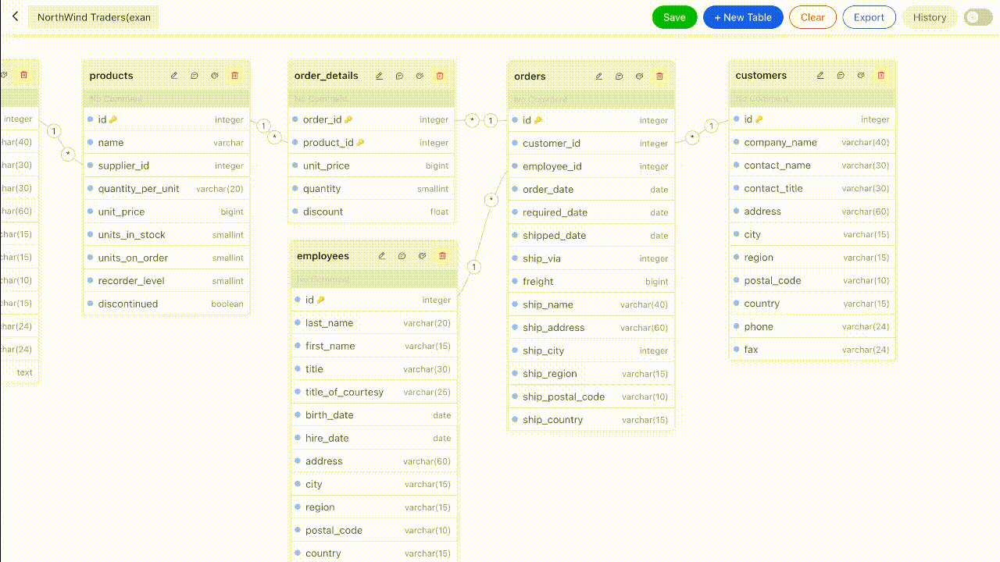

# DBER | 基于实体连接图的数据库设计工具

[English](README.md)

## 网址及演示

https://dber.tech



## 功能

1. 可视化数据库结构设计
2. 拖拽生成模型引用关系
3. 一键导出SQL语句

## 技术栈

SVG

Next.js(React)

DBML

ArcoDesign

Dexie(indexDB)

## 开始

克隆本仓库或者下载代码.

安装依赖.

```bash
npm install
# or
yarn install
```

启动开发服务:

```bash
npm run dev
# or
yarn dev
```

使用浏览器打开 [http://localhost:3000](http://localhost:3000) 查看结果.

在生产模式下运行:

```bash
npm run build && npm run start
```

导出静态页面:

```bash
npm run gen
```

## 使用docker构建

使用以下命令来构建Docker镜像:

```
docker build -t dber .
```

然后可以用Docker或者Docker Compose来启动服务:

```
docker run -p 3000:3000 dber
```

或者

```bash
docker-compose up -d
```

使用浏览器打开 [http://localhost:3000](http://localhost:3000) 查看结果.

## 受到以下作品启发

[dbdiagram](https://dbdiagram.io/)

[antv x6](https://x6.antv.vision/)
